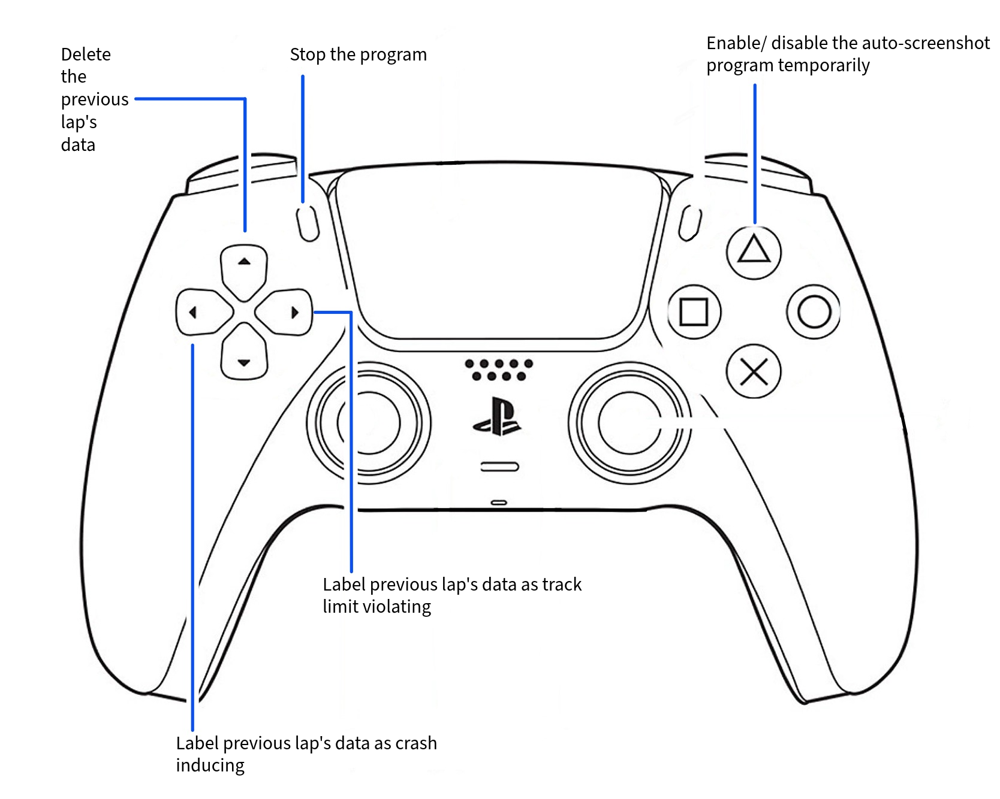
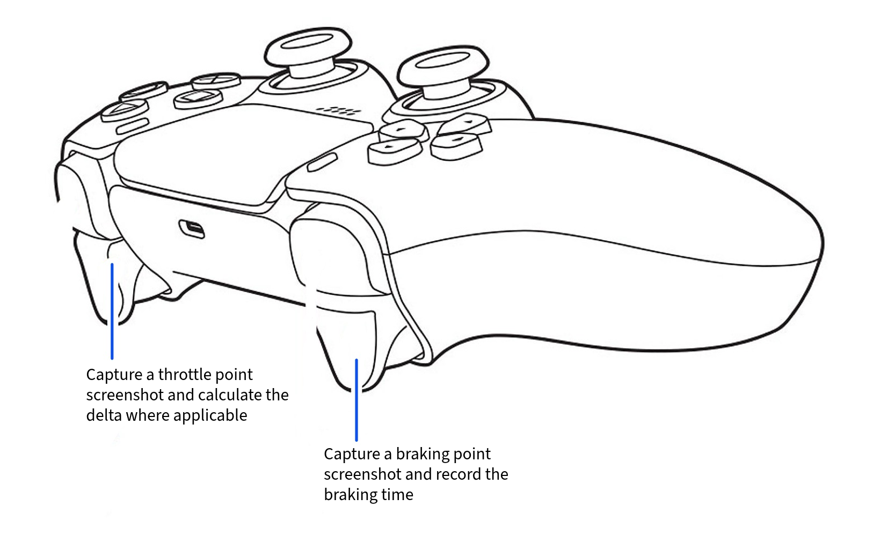
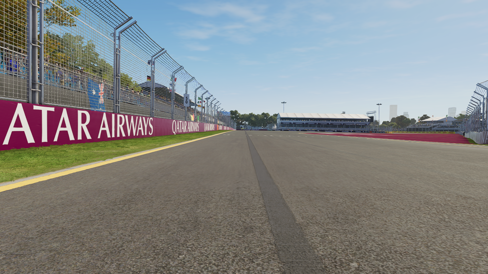
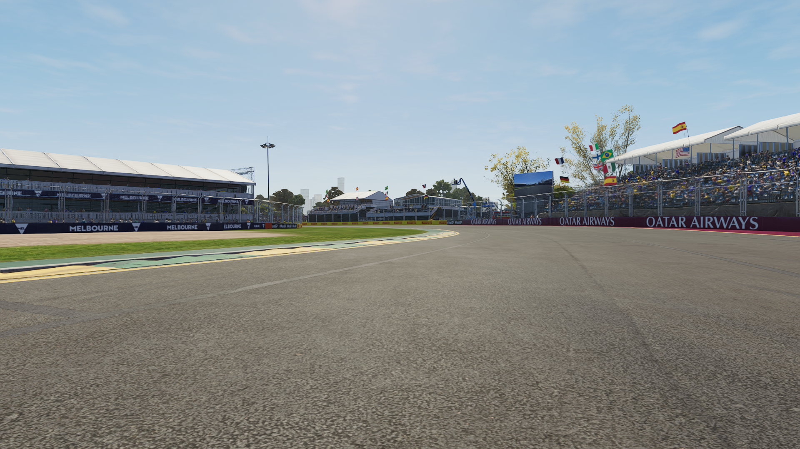
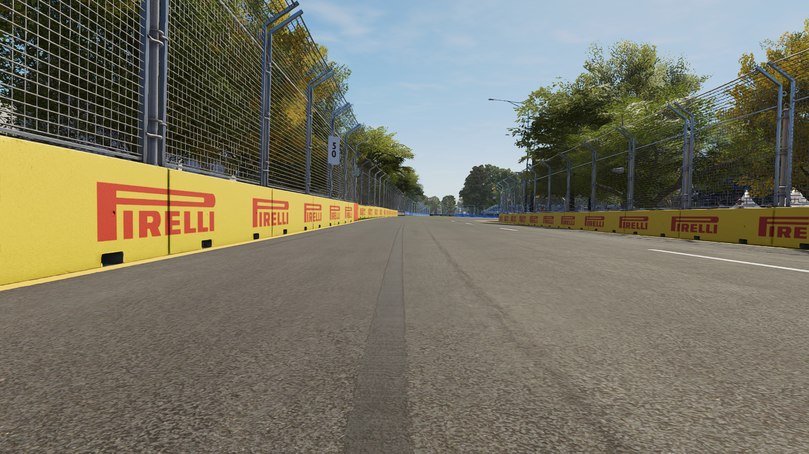
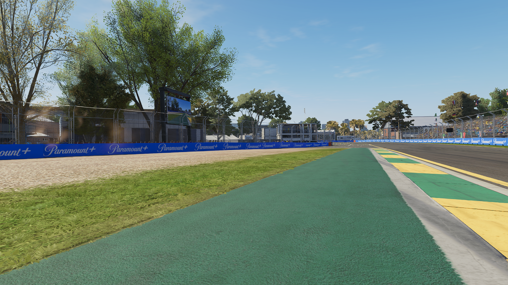

# 1 F1-Optimized-Cornering-Project
The aim of this project is to combine visual and numerical inputs to model corner-taking decisions and their impact on lap-time performance in Formula 1. The scope of this project is limited to sector-1 of the Australian track: Albert Park, but with enough time and data this project could also cover the whole track and other tracks on the Formula 1 calendar as well.

# 2 Data Collection
The dataset used in this project was collected specifically for this investigation rather than obtained from an existing public dataset. Data was recorded using the video game *EA SPORTS F1 25* at the Albert Park Circuit in Melbourne, Australia.

*F1 25* includes five circuits recreated using full-track LiDAR scans: Bahrain, Miami, Melbourne, Suzuka and Imola. EA states that millions of scanned data points were used to reproduce features such as surface bumps and elevation changes. This made the LiDAR-scanned Albert Park circuit a suitable virtual environment for collecting spatially meaningful braking- and throttle-point screenshots.

Further information about the LiDAR-scanned circuits is available on the [official EA F1 25 circuits page](https://www.ea.com/games/f1/f1-25/features/circuits). A more detailed description of how LiDAR data can be transformed into in-game track geometry is provided in [The Future 3D's overview of F1 25 circuit scanning](https://www.thefuture3d.com/blog/f1-25-game-lidar-stadium-track-scanning/).

The collection process produced three main types of data:

1. Screenshots showing the car's position when the brakes were applied.
2. Screenshots showing the car's position when the throttle was applied.
3. Numerical information, including the number of times the brakes and throttles were applied in sector 1, Sector 1 times, and the elapsed time between selected braking and throttle inputs.

Recording the data myself allowed the images, controller inputs and lap-performance measurements to be associated at the individual-lap level.


## 2.1 Track: Albert Park, Melbourne, Australia


To reduce variation caused by parts of the circuit unrelated to the braking and throttle points being studied, the project focuses exclusively on **Sector 1**, highlighted in red above.

Sector 1 contains five turns but generally requires only two or three major braking events. Some of its corners can be taken without heavy braking, depending on the driver's speed and racing line. This made the sector suitable for the project: it is short enough to produce a relatively controlled dataset while still containing meaningful differences in braking position, throttle application and overall sector performance.

Restricting the analysis to one sector also helped reduce the influence of factors such as mistakes made elsewhere in the lap, and differences in performance across unrelated corner types.

## 2.2 Controlled Recording Conditions

To make the recording sessions as comparable as possible, all controllable in-game settings were kept consistent throughout data collection. The same track and environmental conditions were used for every session, while vehicle damage and tyre degradation were disabled.

Disabling these systems prevented later laps from being affected by accumulated tyre wear or damage from earlier mistakes. Keeping the remaining conditions fixed also reduced variation caused by factors unrelated to the braking and throttle behaviour being investigated.

**These controls do not remove all variation between laps**, since sector performance still depends on factors such as steering inputs, racing line, braking position and throttle application. However, they reduce the likelihood that differences in Sector 1 time were primarily caused by changing weather, track conditions, vehicle damage or tyre degradation.

## 2.3 Screenshot and Brake–Throttle Delta Collection
I created `collect_screenshots_and_deltas.py` to automate the collection of gameplay screenshots and controller-input timing data.

During each recorded lap, the script:

- captures a screenshot when the brake trigger is pressed;
- captures a screenshot when the throttle trigger is pressed;
- counts the brake and throttle inputs made during the lap;
- measures the elapsed time between a braking input and the following throttle input;
- associates every screenshot with its recording session, lap number and input number;
- allows invalid laps to be deleted or marked as involving a crash or track-limits violation; and
- writes the recorded brake–throttle timing information to a session-specific CSV file.

The elapsed time between a braking input and the associated throttle input is referred to throughout this project as the **brake–throttle delta**. A shorter or longer delta may reflect differences in how the driver approaches, rotates through and exits a corner.

The script automatically creates a new session directory each time data collection begins, preventing previously recorded screenshots from being overwritten. Screenshots are stored separately in `brake` and `throttle` directories for each session.

## 2.4 Controller Button Guide
<table>
  <tr>
    <th>Controller Guide 1</th>
  </tr>
  <tr>
    <td>
      
    </td>
  </tr>
  <tr>
    <th>Controller Guide 2</th>
  </tr>
  <tr>
    <td>
      
    </td>
  </tr>
</table>

The data-collection script responds to the following PS5 DualSense controller inputs:

| Input | Function |
|---|---|
| **Triangle** | Enables or disables recording for the current lap |
| **L2** | Captures a braking-point screenshot and records the braking time |
| **R2** | Captures a throttle-point screenshot and calculates the brake–throttle delta when applicable |
| **D-pad Up** | Deletes the most recently recorded lap |
| **D-pad Left** | Marks the previous lap as involving a crash |
| **D-pad Right** | Marks the previous lap as involving a track-limits violation |
| **Share** | Stops the program and saves the session's delta data |

The script also displays large coloured terminal messages when recording is enabled or disabled. It was designed to run on a second monitor, allowing the recording state to be recognised through peripheral vision while driving.

> **Note:** The collection script currently depends on the `pydualsense` library and was designed specifically for a PS5 DualSense controller.

## 2.5 Sector-Time Extraction and Data Association

The screenshot-collection script does not directly obtain official sector times from the game. Instead, I used the [Pits n' Giggles F1 Telemetry Companion](https://github.com/ashwin-nat/pits-n-giggles) to export lap-history telemetry from *F1 25*.

The exported JSON files contain the Sector 1 time for each completed lap. These times were later associated with:

- the lap's braking screenshots;
- the lap's throttle screenshots;
- any recorded brake–throttle deltas; and
- incident information such as crashes or track-limits violations.

The `data_collate.py` script combines these sources into a single lap-level dataset while retaining the file paths of all screenshots associated with each lap.

Brake–throttle delta recording was introduced after the first five sessions. Consequently, sessions 1–5 contain screenshots and sector-time information but do not contain delta measurements.

## 2.6 Collected Dataset Summary

Data was recorded across **25 separate driving sessions**, producing a collated dataset of **255 laps**.

The complete collection contains:

| Data component | Amount collected |
|---|---:|
| Recording sessions | 25 |
| Laps with a recorded Sector 1 time | 255 |
| Braking screenshots | 460 |
| Throttle screenshots | 459 |
| Total screenshots | 919 |

Each lap-level record contains:

- its overall recorded lap number;
- its Sector 1 time;
- any recorded incident label;
- the file paths of its braking screenshots;
- the file paths of its throttle screenshots; and
- any available brake–throttle delta measurements.

Brake–throttle delta recording was introduced after the first five sessions. Sessions 1–5 therefore contain Sector 1 times and screenshots but do not contain delta measurements.

This section describes the complete collected dataset before any eligibility filtering. The following section explains which laps were retained for modelling and how their performance labels were assigned.

# 3 Lap Eligibility and Labelling Rules

Not every recorded lap was suitable for training and evaluating the final models. Before assigning performance labels, a set of eligibility rules was applied to remove incident laps, unusually slow sectors and laps with incomplete or inconsistent screenshot sequences.

The full filtering and labelling process is documented in [`data_analysis.ipynb`](Code/notebooks/data_analysis.ipynb).

## 3.1 Original Five-Class Objective

The original aim of the project was to classify laps into five categories:

1. **Optimal**
2. **Standard**
3. **Sub-standard**
4. **Crash-causing**
5. **Track-limits-violating**

The collection script was designed with this objective in mind. After completing a lap, controller inputs could be used to mark its most recent braking and throttle screenshots as having contributed to either a crash or a track-limits violation.

However, the five-class objective proved too ambitious for the amount and structure of the data collected. Of the 255 recorded laps, only:

- **13 laps** were labelled as involving a crash; and
- **39 laps** were labelled as involving a track-limits violation.

These classes were substantially smaller than the ordinary-lap dataset. Their screenshots were also recorded differently: when an incident was marked, the script retained only the final braking and throttle inputs believed to have contributed to the incident rather than a complete two-brake and two-throttle sequence.

Training crash and track-limits classifiers using these small and structurally different groups would have produced unreliable comparisons. The final modelling objective was therefore narrowed to three performance classes:

- **Optimal**
- **Standard**
- **Sub-standard**

Crash and track-limits laps were retained in the raw dataset as records of the collection process but excluded from model training and evaluation.

## 3.2 Eligibility Rules

A recorded lap was considered eligible for performance labelling only when it satisfied all four of the following conditions:

1. **No recorded incident**  
   The lap could not be labelled as involving a crash or track-limits violation.

2. **Sector 1 time below 30,000 ms**  
   Laps with Sector-1 taking 30 seconds or longer were treated as unusually slow observations that were not representative of an ordinary Sector 1 attempt.

3. **Exactly two braking screenshots**  
   Each eligible lap had to contain the same number of braking images.

4. **Exactly two throttle screenshots**  
   Each eligible lap also had to contain the same number of throttle images.

The image-count requirements created a consistent four-image structure for every eligible lap:

- two braking screenshots; and
- two throttle screenshots.

These rules are specific to the dataset and collection method used in this project. They do not imply that every valid lap of Albert Park must contain exactly two braking or throttle applications. Instead, they remove laps affected by missed captures, additional trigger presses or incident-specific recording behaviour.

## 3.3 Filtering Outcome

The eligibility rules reduced the dataset from **255 recorded laps to 197 eligible laps**.

The table below shows the filtering process in the order in which the rules were applied:

| Filtering stage | Laps removed at this stage | Laps remaining |
|---|---:|---:|
| Initial recorded dataset | — | 255 |
| Remove crashes and track-limits violations | 52 | 203 |
| Remove Sector 1 times of 30,000 ms or longer | 1 | 202 |
| Require exactly two braking screenshots | 2 | 200 |
| Require exactly two throttle screenshots | 3 | 197 |

Because the rules were applied sequentially, each excluded lap is counted at the first rule it failed. A lap that failed more than one condition is therefore not counted multiple times in the table.

The final 197 eligible laps contain **788 modelling images**, consisting of two braking and two throttle screenshots per lap.

Of these 197 laps:

- **169 laps** contain two complete brake–throttle delta measurements; and
- **28 laps** do not contain delta data because they were recorded during Sessions 1–5.

All 197 laps could be used by the image model, while only the 169 laps with complete delta measurements could be used by the delta model and the final fused pipeline.

## 3.4 Quantile-Based Performance Labels

The three performance classes were defined using the distribution of Sector 1 times among the **197 eligible laps**.

The first and third quartiles were:

- **First quartile (Q1): 28,103 ms**
- **Third quartile (Q3): 28,569 ms**

The following rules were then applied:

| Performance class | Sector 1 time rule | Number of laps |
|---|---|---:|
| **Optimal** | `Sector 1 time <= 28,103 ms` | 50 |
| **Standard** | `28,103 ms < Sector 1 time < 28,569 ms` | 97 |
| **Sub-standard** | `Sector 1 time >= 28,569 ms` | 50 |

This assigns approximately:

- the fastest quarter of eligible laps to the **Optimal** class;
- the middle half to the **Standard** class; and
- the slowest quarter to the **Sub-standard** class.

Using quartiles avoided selecting arbitrary time boundaries and produced two equally sized extreme-performance classes, with the larger standard class representing the centre of the observed performance distribution.

## 3.5 Interpretation of the Labels

The labels describe performance **relative to the dataset collected for this project**.

An **Optimal** label means that a lap belongs to the fastest quarter of the eligible recorded observations. It does not mean that the lap represents a theoretically perfect racing line, a professional Formula 1 lap or the fastest possible Sector 1 time at Albert Park.

Similarly, **Sub-standard** refers to the slowest quarter of this dataset rather than an objectively poor lap under every possible driving condition.

The labels are derived from Sector 1 time, which is the outcome the models attempt to predict from braking screenshots, throttle screenshots and brake–throttle delta measurements. These recorded inputs are expected to contain useful information about performance, but they do not capture every factor that may affect the sector time, such as steering input, racing line or corner-entry speed.

# 4 Models

Three modelling approaches were evaluated:

1. A convolutional neural network using screenshots captured at controller inputs.
2. A logistic regression model using brake–throttle timing measurements.
3. A probability-fusion model combining the CNN and logistic regression outputs.

The complete implementation and experimental comparisons are available in [`final_modelling.ipynb`](Code/notebooks/final_modelling.ipynb).

## 4.1. Evaluation Protocol

The data was split by **recording session**, rather than by individual image or lap.

This prevents screenshots from the same session from appearing in both training and evaluation subsets. Images recorded during one session may share visual conditions and driver behaviour, so an image-level random split could produce information leakage.

The fixed split contains:

| Subset | Sessions | Eligible laps | Images |
|---|---:|---:|---:|
| Training | 17 | 139 | 556 |
| Validation | 4 | 27 | 108 |
| Test | 4 | 31 | 124 |

The validation set was used to compare CNN configurations, image-aggregation strategies and fusion methods. The test set was evaluated only after the final pipeline had been selected.

### 4.1.1 Evaluation Metrics

Ordinary accuracy measures the proportion of all predictions that are correct:

```math
\mathrm{Accuracy}
=
\frac{\text{Number of correct predictions}}
{\text{Total number of predictions}}
```

However, the final dataset contains twice as many standard laps as either optimal or sub-standard laps. A model could therefore obtain a misleadingly high ordinary accuracy by favouring the standard class.

For this reason, **balanced accuracy** was used as the main model-selection metric. Balanced accuracy is the mean recall across the three classes:

```math
\mathrm{Balanced\ Accuracy}
=
\frac{
\mathrm{Recall}_{\mathrm{optimal}}
+
\mathrm{Recall}_{\mathrm{standard}}
+
\mathrm{Recall}_{\mathrm{substandard}}
}{3}
```

This gives equal importance to each class regardless of its frequency.

Ordinary accuracy was used as a secondary metric. Confusion matrices, class-wise precision, recall and F1-scores were also examined to identify which classes were responsible for model errors.

## 4.2 Convolutional Neural Network

The image model was based on **ResNet18**, initialised using weights learned from ImageNet.

Transfer learning was used because the project contains only 788 eligible images, which is insufficient for reliably training a deep convolutional network from random initialisation.


> The diagram above shows the sections of ResNet18 that were frozen and fine-tuned in the selected configuration.

### 4.2.1 Fine-Tuning Experiments

Four transfer-learning strategies were compared:

| Configuration | Trainable components |
|---|---|
| Fully fine-tuned | Entire ResNet18 network |
| Frozen backbone | Classification layer only |
| Partial fine-tuning | Entire final residual layer and classification layer |
| Last-block fine-tuning | Final residual block and classification layer |

Fully fine-tuning the network allowed maximum adaptation to the project images but produced substantial overfitting. At the other extreme, freezing the complete backbone restricted the network's ability to adapt its visual features.

The selected configuration trained:

- the second block of the final residual layer, `layer4[1]`; and
- the replacement three-class classification layer.

The remaining pretrained layers were frozen. Batch-normalisation parameters in the trainable residual block were also kept frozen to reduce instability caused by the small training set.

This configuration provided a balance between preserving pretrained visual features and allowing limited task-specific adaptation.

### 4.2.2 From Image Predictions to Lap Predictions

The CNN produces one probability vector for each screenshot, but the target label belongs to the complete lap.

Each *eligible* lap contains:

- two braking screenshots; and
- two throttle screenshots.

Several methods for combining the image probabilities were evaluated on the validation set:

- mean probability across all four screenshots;
- mean of the two braking-image probabilities;
- mean of the two throttle-image probabilities;
- maximum probability across the images; and
- mean logits followed by softmax.

Averaging the probabilities from the **two throttle screenshots** produced the strongest validation performance. The final CNN prediction for a lap was therefore:

```math
p_{\mathrm{CNN}}(c)
=
\frac{
p_{\mathrm{throttle\ 1}}(c)
+
p_{\mathrm{throttle\ 2}}(c)
}{2}
```

This result implies that throttle screenshots either contained more useful information about Sector 1 performance or were represented more consistently across laps.

It does not prove that braking position is unimportant. It only shows that the trained CNN extracted more reliable validation predictions from the throttle screenshots in this dataset.


## 4.3 Delta Logistic Regression Model

The second model used numerical measurements rather than images.

For each *eligible* lap with complete delta information, two features were used:

1. the first recorded brake-to-throttle time interval; and
2. the second recorded brake-to-throttle time interval.

These features are referred to as:

- `delta_1_seconds`; and
- `delta_2_seconds`.

Both features were used by the model. The model consisted of:

1. a `StandardScaler` to standardise the two features; and
2. a three-class logistic regression classifier.

Balanced class weights were also used so that errors in the smaller optimal and sub-standard classes received greater importance during training.

The delta model outputs a probability for each performance class:

```math
p_{\Delta}(c)
=
P\left(
Y=c
\mid
\Delta_1,\Delta_2
\right)
```

**Delta recording was introduced after Session 5.** Consequently, the delta model could use only the **169 eligible laps** with two complete measurements, rather than all 197 laps available to the CNN.

## 4.4 Fusion Model

The CNN and logistic regression model represent different aspects of the lap:

- the CNN uses the visual position of the car when throttle is applied;
- the delta model uses the elapsed time between braking and subsequent throttle application.

Combining their probabilities was investigated because the two models may contain complementary information.

Three fusion strategies were compared:

1. weighted arithmetic fusion; and
2. weighted geometric fusion;

### 4.4.1 Arithmetic Fusion

Arithmetic fusion calculates a weighted average of the model probabilities:

```math
p_{\mathrm{fused}}(c)
=
w_{\mathrm{CNN}}p_{\mathrm{CNN}}(c)
+
w_{\Delta}p_{\Delta}(c)
```

where:

```math
w_{\mathrm{CNN}} + w_{\Delta} = 1
```

### 4.4.2 Geometric Fusion

Geometric fusion combines the probabilities multiplicatively:

```math
p_{\mathrm{fused}}(c)
\propto
p_{\mathrm{CNN}}(c)^{w_{\mathrm{CNN}}}
p_{\Delta}(c)^{w_{\Delta}}
```

This method penalises a class when either model assigns it a very low probability and therefore favours classes that receive support from both sources.

The calculation was performed in log space for numerical stability:

```math
\log p_{\mathrm{fused}}(c)
=
w_{\mathrm{CNN}}\log p_{\mathrm{CNN}}(c)
+
w_{\Delta}\log p_{\Delta}(c)
```

CNN weights from 0.00 to 1.00 were evaluated on the validation set in increments of 0.01.

The selected final configuration used:

- **CNN weight: 0.37**
- **Delta-model weight: 0.63**
- **Fusion method: geometric probability fusion**

Geometric fusion produced the strongest validation result and was therefore locked before the final test evaluation.


# 5 Results

## 5.1 Validation-Based Model Selection

Four ResNet18 fine-tuning strategies were compared using the fixed validation set:

| CNN configuration | Standalone CNN accuracy | Standalone CNN balanced accuracy | Best fused accuracy | Best fused balanced accuracy |
|---|---:|---:|---:|---:|
| Fully fine-tuned | 51.85% | 51.28% | 66.67% | 70.33% |
| Frozen backbone | 48.15% | 59.71% | 59.26% | 65.20% |
| Entire final residual layer trainable | 55.56% | 53.85% | 66.67% | 68.13% |
| Final residual block trainable | 51.85% | 53.48% | **70.37%** | **70.70%** |

Although the final-block CNN was not the strongest standalone CNN on the validation set, it produced the strongest result when combined with the delta logistic regression model.

The selected pipeline used:

- the ResNet18 checkpoint with only the final residual block and classification layer trainable;
- the mean probability from the two throttle screenshots;
- the delta logistic regression probabilities;
- geometric probability fusion;
- a CNN weight of **0.37**; and
- a delta-model weight of **0.63**.

This configuration correctly classified **19 of the 27 validation laps**, producing:

- **70.37% accuracy**
- **70.70% balanced accuracy**

The checkpoint, aggregation method, fusion strategy and weights were fixed before the test set was evaluated.

## 5.2. Fixed Test Evaluation

The selected pipeline was evaluated on the fixed test set containing **31 laps** from Sessions 6, 7, 8 and 25.

| Model | Accuracy | Balanced accuracy |
|---|---:|---:|
| Majority baseline | 48.39% | 33.33% |
| Throttle-only CNN | **58.06%** | **61.39%** |
| Delta logistic regression | 41.94% | 42.50% |
| CNN + delta geometric fusion | 51.61% | 55.00% |

The throttle-only CNN was the strongest model on the fixed test set.

The fused model had performed best during validation but did not outperform the CNN on the test sessions. The delta logistic regression model generalised poorly to these sessions, and because the final fusion assigned a weight of 0.63 to the delta probabilities, several inaccurate delta predictions weakened the stronger CNN predictions.

The fusion model correctly classified:

- **6 of 8 optimal laps**
- **6 of 15 standard laps**
- **4 of 8 sub-standard laps**

The standard class was the most difficult to distinguish, with predictions spread across all three classes. This is reasonable because the standard class occupies the middle of the Sector 1 time distribution and borders both the optimal and sub-standard classes.

## 5.3. Leave-One-Session-Out Robustness Analysis

A leave-one-session-out analysis was conducted to examine whether the results depended too heavily on the original train, validation and test split.

Each of Sessions 6–25 was held out once. For every fold:

1. the CNN was trained using all other eligible sessions;
2. the delta model was fitted using the remaining sessions with complete delta measurements;
3. predictions were generated for the held-out session; and
4. the previously selected fusion weights of 0.37 and 0.63 were applied.

This produced out-of-fold predictions for **169 laps across 20 held-out sessions**.

| Model | Accuracy | Balanced accuracy |
|---|---:|---:|
| Fold-specific majority baseline | 50.30% | 33.33% |
| Throttle-only CNN | 62.72% | 58.79% |
| Delta logistic regression | 53.85% | 60.05% |
| CNN + delta geometric fusion | **63.91%** | **66.41%** |

Across the pooled leave-one-session-out predictions, geometric fusion achieved the strongest overall performance.

The fused model correctly classified:

- **31 of 49 optimal laps**
- **50 of 85 standard laps**
- **27 of 35 sub-standard laps**

This corresponds to class recalls of approximately:

- **63.27% for optimal**
- **58.82% for standard**
- **77.14% for sub-standard**

The fusion model also produced the highest mean session accuracy and the lowest session-to-session variation:

| Model | Mean session accuracy | Session accuracy standard deviation |
|---|---:|---:|
| Throttle-only CNN | 63.86% | 18.87% |
| Delta logistic regression | 58.16% | 22.58% |
| CNN + delta geometric fusion | **64.85%** | **16.81%** |

The fixed test and leave-one-session-out results provide different conclusions. The standalone CNN was strongest on the original fixed test set, while fusion was strongest across the broader set of held-out sessions.

# 6 Limitations

## 6.1 Dataset Size and Scope

The final eligible dataset contains 197 laps, of which 169 have complete delta measurements. This is a small dataset for fine-tuning a convolutional neural network.

All laps were recorded by myself on Sector 1 of one circuit. The results therefore cannot be assumed to generalise to other drivers, circuits, sectors or game settings.

## 6.2 Unequal Session Composition

Recording sessions contain different numbers of eligible laps, and several sessions do not contain examples from all three classes.

This makes some session-level metrics more variable. In particular, balanced accuracy calculated for a session missing one or more classes is not directly comparable with the balanced accuracy of a session containing all three classes.

## 6.3 Visual Differences Between Sessions

From Session 20 onward, trackside wall sponsorship changed from Louis Vuitton branding to Qatar Airways branding.

Although the track geometry remained unchanged, the difference in background colour and appearance may provide the CNN with a session-related visual cue that is unrelated to driving performance.

## 6.4 Quantile-Based Labels

The three classes contain approximately equal-frequency performance regions, but **the time intervals represented by those classes are not equal in width**.

The difference between a standard and sub-standard lap may therefore be larger than the difference between an optimal and standard lap. Laps positioned immediately on opposite sides of a quartile boundary may also have nearly identical Sector 1 times despite receiving different labels.

## 6.5 Unrecorded Driving Factors

Braking position, throttle position and brake–throttle timing do not fully determine Sector 1 performance.

Other relevant variables may include:

- steering angle;
- racing line;
- corner-entry speed;
- minimum corner speed;
- brake pressure;
- throttle pressure;
- gear selection; and
- wheel slip.

Variation in these unrecorded factors may explain why similar screenshots or deltas sometimes produced different Sector 1 times.

## 6.6 Limited Telemetry Availability

The available telemetry provided sector times but did not supply every potentially useful signal in a convenient form.

Continuous spatial coordinates, steering input, vehicle speed and pedal-pressure measurements may have provided a more direct representation of driving behaviour than screenshots alone.

## 6.7 Missing Delta Measurements

Brake–throttle delta recording began after Session 5. The CNN could therefore use all 197 eligible laps, while the delta and fusion models were restricted to 169 laps.

# 7 Reproducibility
todo

# 8 Repository Guide

## 8.1 Repository Structure 

```bash
root
├── Code 
│   ├── notebooks
│   │   ├── data_analysis.ipynb
│   │   ├── final_modelling.ipynb
│   │   ├── rebuild_manifests_and_splits.ipynb
│   │   └── sector_time_extraction.ipynb
│   ├── scripts
│   │   ├── collect_screenshots_and_deltas.py
│   │   └── collate_session_data.py
│   └── README.md
├── Data
│   ├── brake-throttle-delta-data
│   ├── collated-data
│   ├── image-data
│   │   ├── session-1
│   │   │   ├── brake 
│   │   │   └── throttle
│   │   ├── session-2
│   │   │   ├── brake 
│   │   │   └── throttle
│   │   ...
│   │   ...
│   ├── manifests
│   │   ├── image-manifest.csv
│   │   ├── lap-manifest.csv
│   │   ├── image-manifest-with-split.csv
│   │   └── lap-manifest-with-split.csv
│   ├── readme-images
│   ├── results
│   │   ├── loso
│   │   ├── test
│   │   ├── validation
│   ├── sector-time-data
│   └── README.md
├── Models
└── README.md
```
## 8.2 Example Model Inputs

Each eligible lap contains four screenshots captured during Sector 1:

1. the first braking input;
2. the first throttle input;
3. the second braking input; and
4. the second throttle input.

The following images show the four screenshots associated with one representative eligible lap.

<table>
  <tr>
    <th>Brake Input 1</th>
    <th>Throttle Input 1</th>
  </tr>
  <tr>
    <td>
      
    </td>
    <td>
      
    </td>
  </tr>
  <tr>
    <th>Brake Input 2</th>
    <th>Throttle Input 2</th>
  </tr>
  <tr>
    <td>
      
    </td>
    <td>
      
    </td>
  </tr>
</table>

Although all four screenshots were available during model development, validation experiments found that averaging the predictions from the two throttle screenshots produced the strongest lap-level CNN performance. The final image model therefore uses only the two throttle images when generating a prediction for a lap.

The screenshots do not directly display the brake–throttle delta measurements. Those values were recorded separately by the controller-input collection script and supplied to the logistic regression model as numerical features.The following table shows the numerical data associated with the final lap recorded.

| Example attribute | Value |
|---|---:|
| Sector 1 time | 28.092 s |
| Assigned class | Optimal |
| First brake–throttle delta | 1.560 s |
| Second brake–throttle delta | 2.180 s |