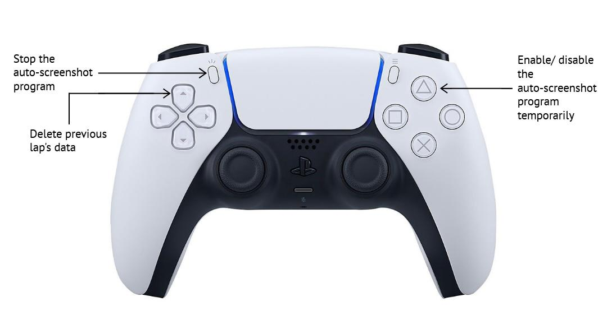

# F1-Optimized-Cornering-Project
The aim of this project is to combine visual and numerical inputs to model corner-taking decisions and their impact on lap-time performance in Formula 1.

**Track:** Albert Park, Melbourne, Australia

For this project, in an effort to reduce confounding factors that might have had an impact on the lap time apart from the braking and throttle points, the data recorded is only of Sector 1 of the track (the part highlighted in red). The first sector has 5 turns and usually a pilot does not need to break more than three or even two times as the other corners don't necessarily require the driver to slow down or stop accelerating.


## Shiny App

## Controller Button Guide

**Note**: The auto-screenshotting program only works for the PS5 DualSense controller.

### Repository File Structure 

```bash
root
├── Code 
│   ├── notebooks
│   │   ├── data_analysis.ipynb
│   │   ├── final_modelling.ipynb
│   │   ├── rebuild_manifests_and_splits.ipynb
│   │   └── sector_time_extraction.ipynb
│   ├── scripts
│   │   ├── collect_screenshots_and_deltas.py
│   │   └── collate_session_data.py
│   └── README.md
├── Data
│   ├── brake-throttle-delta-data
│   ├── collated-data
│   ├── image-data
│   │   ├── session-1
│   │   │   ├── brake 
│   │   │   └── throttle
│   │   ├── session-2
│   │   │   ├── brake 
│   │   │   └── throttle
│   │   ...
│   │   ...
│   ├── manifests
│   │   ├── image-manifest.csv
│   │   ├── lap-manifest.csv
│   │   ├── image-manifest-with-split.csv
│   │   └── lap-manifest-with-split.csv
│   ├── readme-images
│   ├── results
│   │   ├── loso
│   │   ├── test
│   │   ├── validation
│   ├── sector-time-data
│   └── README.md
├── Models
└── README.md
```
